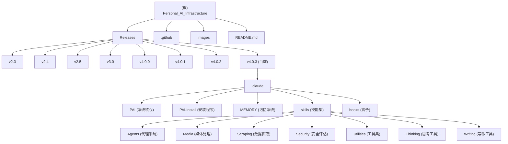

# Personal AI Infrastructure - 项目索引

> **更新时间：** 2026-03-08 11:02:31
> **版本：** v4.0.3
> **状态：** 活跃开发中

---

## 项目愿景

**Personal AI Infrastructure (PAI)** 的使命是让每个人都能获得最好的 AI 基础设施，而不仅仅是技术精英或富裕阶层。这是一个开源的个人 AI 平台，旨在通过 AI 增强人类能力，帮助人们识别、表达和追求自己的人生目标。

PAI 构建在 Claude Code 之上，提供了持久化记忆、自定义技能、智能路由和持续学习等能力，将普通的 AI 交互转变为真正了解你的个人 AI 助手。

---

## 架构总览

PAI 采用**版本化发布**模式，每个版本都是一个完整的 `.claude/` 目录，可直接复制到用户主目录使用。

### 核心架构层次

1. **Release 层** - 版本化的发布包（v2.3 ~ v4.0.3）
2. **System 层** - PAI 核心系统文档和工具
3. **Skill 层** - 模块化能力单元（技能）
4. **Hook 层** - 生命周期事件处理
5. **User 层** - 用户个性化数据和配置

### 技术栈

| 类别 | 技术 |
|------|------|
| **运行时** | Bun, Node.js |
| **语言** | TypeScript, Bash, Python |
| **基础平台** | Claude Code (Anthropic) |
| **浏览器自动化** | Playwright |
| **界面** | Electron, Vue.js (部分组件) |
| **语音** | ElevenLabs TTS |
| **存储** | 文件系统 (JSON, Markdown) |

---

## 模块结构图



---

## 模块索引

### Release 版本（历史发布）

| 版本 | 路径 | 主要特性 | 状态 |
|------|------|----------|------|
| **v4.0.3** | `Releases/v4.0.3/` | 社区 PR 修复：JSON 解析、死链接清理、可移植性、升级迁移 | 当前稳定版 |
| **v4.0.2** | `Releases/v4.0.2/` | Bug 修复补丁：Linux 兼容性、安装程序、状态栏、钩子 | 稳定 |
| **v4.0.1** | `Releases/v4.0.1/` | 升级路径与偏好设置：温度单位配置、FAQ 修复 | 稳定 |
| **v4.0.0** | `Releases/v4.0.0/` | 精简重构：38 个扁平技能目录 → 12 个分层类别 | 重大更新 |
| **v3.0.0** | `Releases/v3.0/` | 算法成熟：约束提取、构建漂移预防、持久化 PRD | 稳定 |
| **v2.5.0** | `Releases/v2.5/` | 深度思考：元认知、并行执行、双遍能力选择 | 稳定 |
| **v2.4.0** | `Releases/v2.4/` | 算法系统：7 阶段问题解决、ISC 追踪 | 稳定 |
| **v2.3.0** | `Releases/v2.3/` | 持续学习：显式/隐式评分捕获、记忆系统 | 稳定 |

### 系统核心模块（v4.0.3）

| 模块 | 路径 | 职责 | 关键文件 |
|------|------|------|----------|
| **PAI 系统** | `.claude/PAI/` | 核心架构文档和工具 | `README.md`, `SKILL.md`, `Algorithm/`, `Tools/` |
| **安装程序** | `.claude/PAI-Install/` | Electron GUI 安装向导 | `install.sh`, `electron/`, `engine/` |
| **记忆系统** | `.claude/MEMORY/` | 持久化学习和上下文 | `LEARNING/`, `RELATIONSHIP/`, `STATE/` |
| **技能系统** | `.claude/skills/` | 模块化能力单元 | 各技能目录的 `SKILL.md` |
| **钩子系统** | `.claude/hooks/` | 生命周期事件处理 | `*.hook.ts` 文件 |

### 技能分类（v4.0.3：12 大类别 49+ 技能）

| 类别 | 技能数量 | 描述 | 代表技能 |
|------|----------|------|----------|
| **Agents** | 多个 | 代理系统和团队协作 | Algorithm, Engineer, Architect, Researcher |
| **Media** | 多个 | 媒体处理与创作 | Art, Remotion, Video |
| **Scraping** | 多个 | 数据抓取与提取 | Browser, Apify |
| **Security** | 多个 | 安全评估与渗透测试 | WebAssessment, BugBountyTool |
| **Utilities** | 多个 | 实用工具集 | Prompting, Templates |
| **Thinking** | 多个 | 思考与分析工具 | FirstPrinciples, Council, RedTeam |
| **Writing** | 多个 | 写作与文档生成 | Documents (Docx, Pdf, Pptx) |
| **PAI** | 1 | PAI 核心技能 | PAI SKILL.md |
| **Telos** | 1 | 生活目标管理 | Telos SKILL.md |

---

## 运行与开发

### 快速开始

```bash
# 克隆仓库
git clone https://github.com/danielmiessler/Personal_AI_Infrastructure.git
cd Personal_AI_Infrastructure/Releases/v4.0.3

# 复制并运行安装程序
cp -r .claude ~/ && cd ~/.claude && bash install.sh
```

### 开发环境

- **Bun 运行时**：`bun install && bun run ...`
- **TypeScript**：所有 `.ts` 文件可通过 `bun run` 执行
- **Shell 脚本**：直接 `bash script.sh` 或通过 `./script.sh` 执行

### 测试策略

- PAI 使用 Claude Code 的内置测试框架
- 技能测试通过实际使用验证
- 钩子测试通过会话生命周期验证

---

## 编码规范

1. **TypeScript 优先** - 新工具和功能使用 TypeScript
2. **Shell 脚本** - 系统级操作使用 Bash
3. **Markdown 文档** - 所有文档使用 Markdown 格式
4. **SKILL.md 标准** - 每个技能必须有标准化的 SKILL.md 文件
5. **上下文路由** - 使用 `CONTEXT_ROUTING.md` 定义的路径

---

## AI 使用指引

### 用于 PAI 开发

PAI 本身就是为 AI 辅助开发而设计的系统。当为 PAI 贡献代码时：

1. **阅读核心文档**：
   - `PAI/SKILL.md` - PAI 的核心技能定义
   - `PAI/PAISYSTEMARCHITECTURE.md` - 系统架构
   - `PAI/SKILLSYSTEM.md` - 技能系统设计

2. **创建新技能**：
   - 使用 `CreateSkill` 工具
   - 遵循 SKILL.md 模板
   - 包含触发器、工作流、工具

3. **添加钩子**：
   - 在 `hooks/` 创建 `*.hook.ts` 文件
   - 在 `settings.json` 注册

4. **测试**：
   - 在本地 `.claude/` 目录测试
   - 验证技能触发和工作流

### 用于其他项目

PAI 的设计理念可应用于任何需要持久化 AI 助手的项目：

- **记忆系统** - 保存学习和上下文
- **技能系统** - 模块化能力
- **钩子系统** - 生命周期事件
- **算法** - 7 阶段问题解决

---

## 变更记录 (Changelog)

### 2026-03-08 - 初始化完成
- 📊 创建项目根级 CLAUDE.md
- 🗂️ 建立模块索引和分类
- 📈 生成 Mermaid 结构图
- 🔍 记录 8 个历史版本
- ✨ 文档化 12 大技能类别
- 📋 整理技术栈和开发指南

---

## 相关资源

- **主 README**：`README.md` - 完整的项目介绍和使用指南
- **平台兼容性**：`PLATFORM.md` - 跨平台支持状态
- **Releases README**：`Releases/README.md` - 所有版本列表
- **当前版本**：`Releases/v4.0.3/README.md` - v4.0.3 发布说明
- **GitHub**：https://github.com/danielmiessler/Personal_AI_Infrastructure
- **作者博客**：https://danielmiessler.com

---

*本文档由 PAI 初始化架构师生成 - 2026-03-08 11:02:31*
